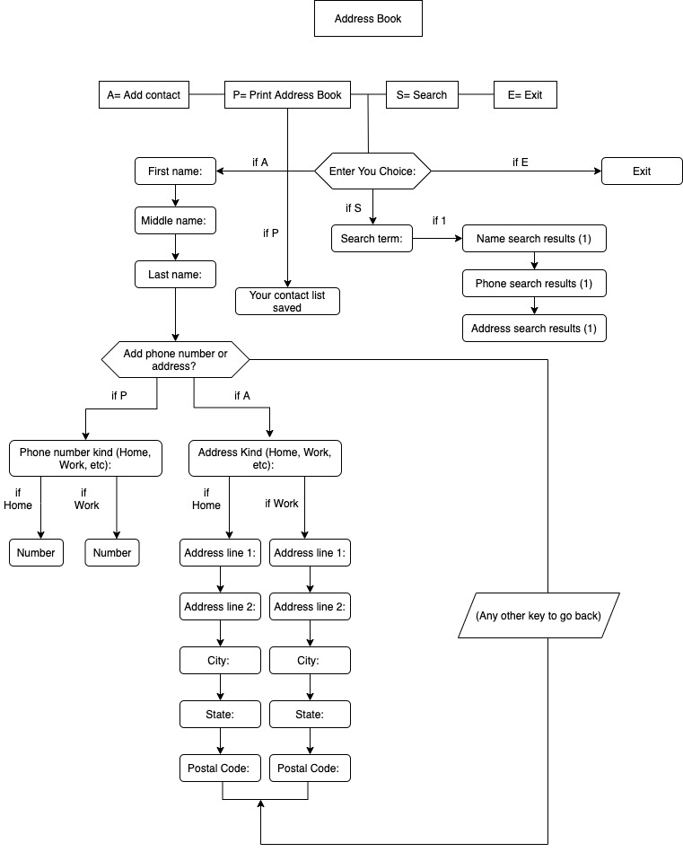
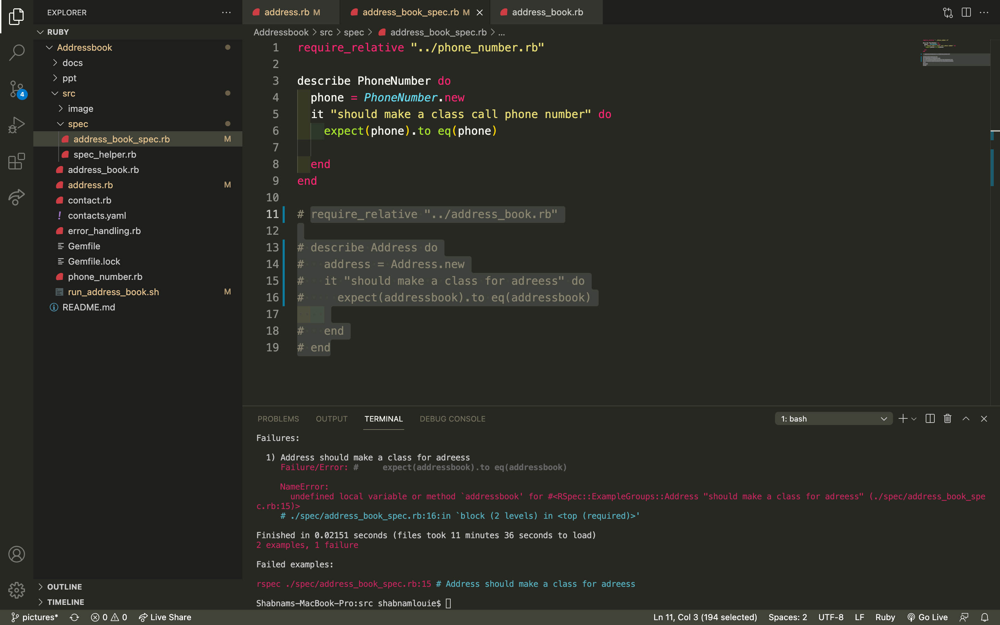
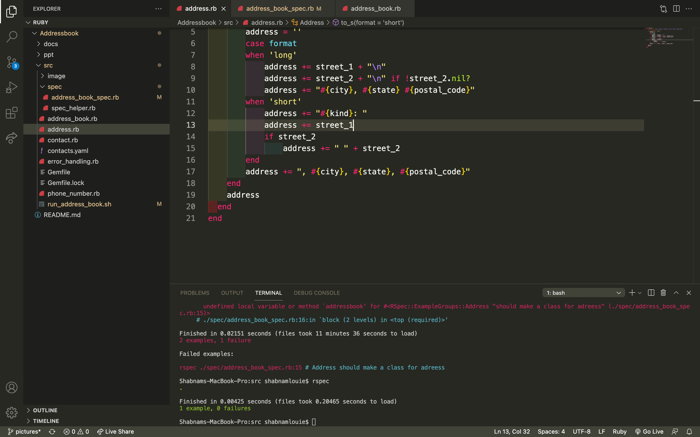
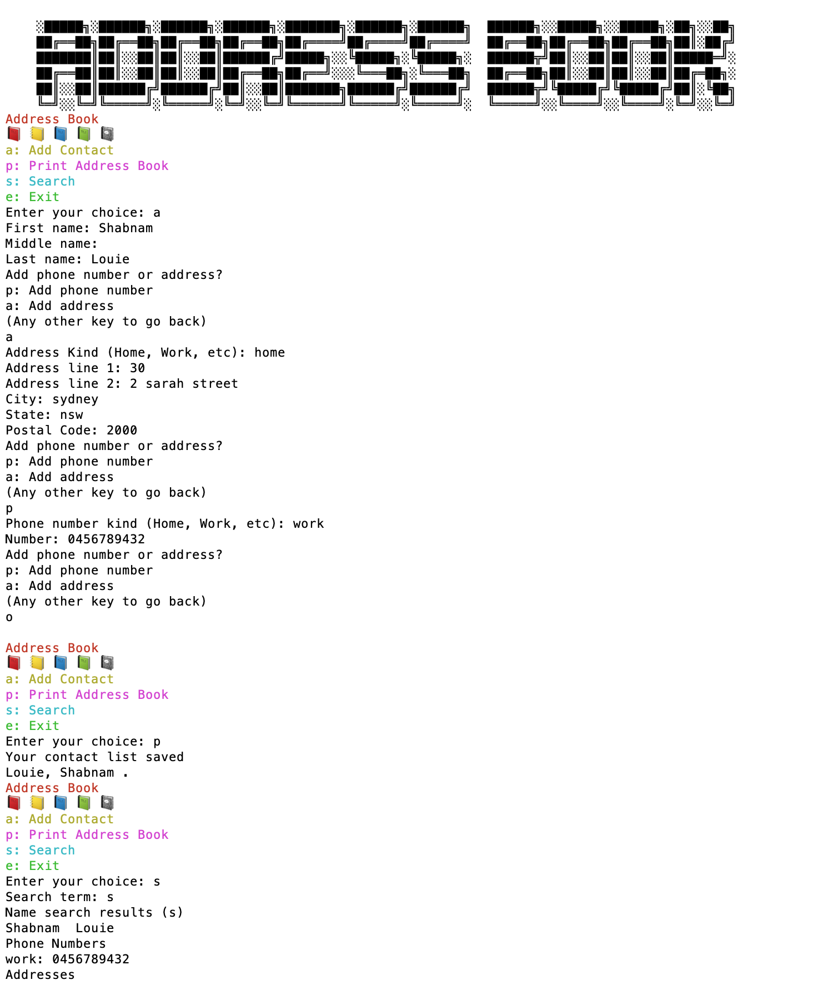
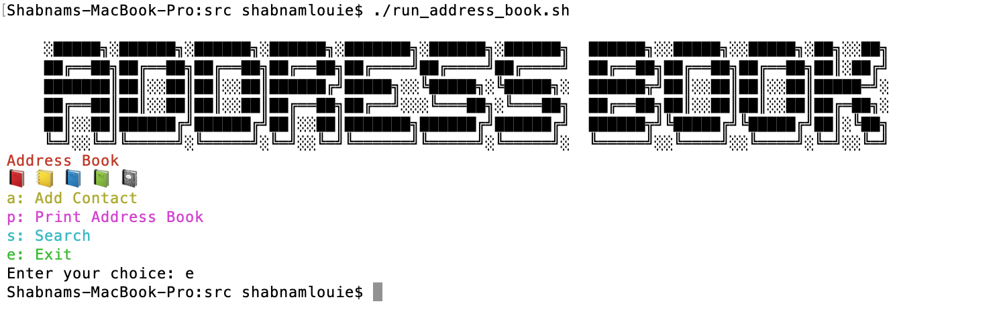
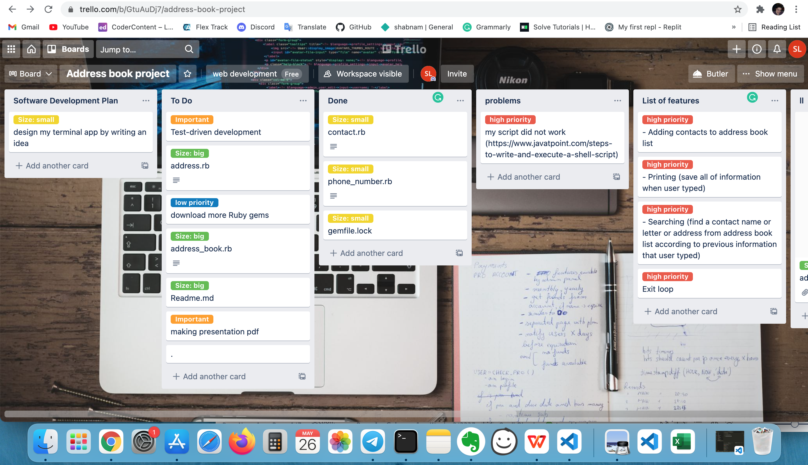
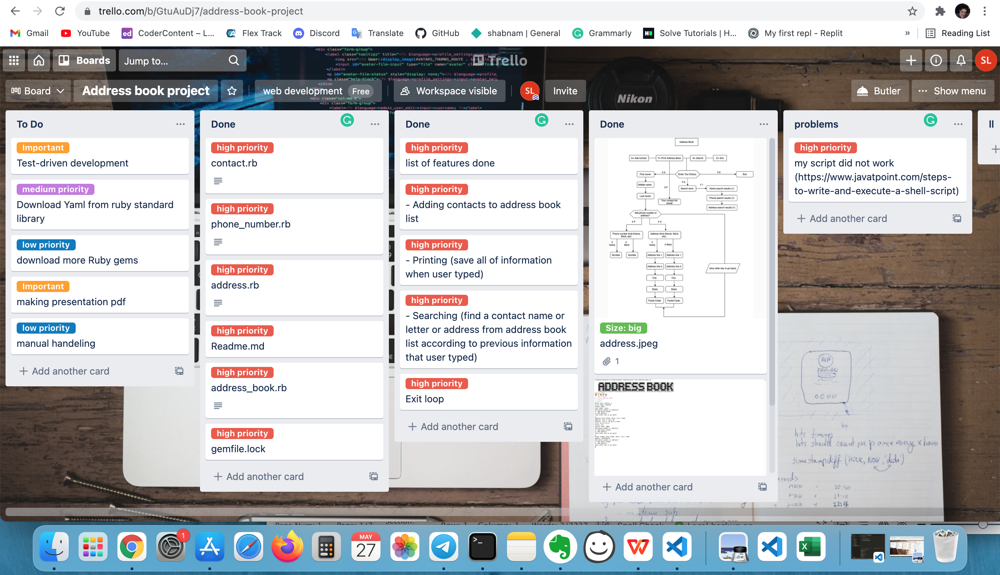
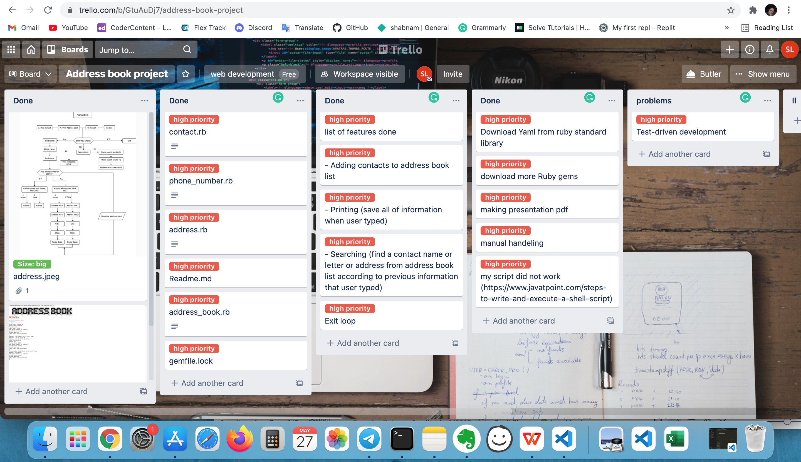

# 📓 ADDRESS BOOK TERMINAL APPLICATION WITH RUBY 📓

[Link to GitHub repository](https://github.com/shabnamlouie/Addressbook)

## Control Flow:
##### This flow chart describes development of my terminal application.

### Description: 
I built an Address Book terminal app with Ruby in the command-line program to let the user put in the names and information of all of their contacts.

Then, the user will add in the ability to go through and search these contacts.
Because of saving the address and phone number this app is good for all people.

For this app I used gems such as: artii, colorize, tty-box, tty-prompt, pry, json, rake, sqlite3, activerecord.

So each line of the code shows with different colors to make nice for user.

Making error handling and helping user with displaying instructions on what the user should type and if user type something else back to the previous menu.

## Important point:
Nowdays people are busy with technology and their life and do not have time to see their friends and family member alot so obviously they could not remmeber all of addresses and phone numbers, so this app helps their issue in this case.

## Target audience:
My target audience are users who access to my codes, such as my teachers and my classmates. Also all of people who instead of remembering their contact lists they can carry the address book list at all the time.

## Main Features:
- Adding contacts to address book list
- Printing (save all of information when user typed)
- Searching (find a contact name or letter or address from address book list according to previous information that user typed)
- Exit

## The process of making address book and showing how main features works:
I create classes for each different parts of the address book project.
Such as: include the address book itself, contacts, and their information.
#### 1- Contact file:
I add a file to my address book folder with the name of the contact.RB and start with the user contact class, which will keep my contacts. 

The contact is going to include the idea of one of my friends in the address book.

My contact file includes a first name, middle name, and last name, so I create attribute writers. 

Then I wrote methods and variables to read first_name, middle_name, last_name.

For testing, I create a new contact, as my name first_name is Shabnam, and add my last name is Louie. 

I wanted to show my full name together, so I made another method called full_name and refer to first_name, middle_name, last_name.

User type first name, and if does not have middle name it can go to next question and ask the last name.

Make string method of full name, then use a case statement to see what the format is. 

By default, return first and last name and did not include middle name.

#### 2- Phone_number file:
I create my phone number class into phone_number.RB file.

Make attribute accessor for the kind of numbers such as home or work or mobile.

Make string method for kind and number
And add phone numbers to my contacts in the contact file. My contact is attribute reader for phone numbers.

And initialize my contact and set the phone number in the empty array
Create a method to add contacts to my contact list with two arguments kind and number.

Make a new phone number instance with the kind and number argument.

Create method print phone numbers by using each method through the loop.

Make access to my phone number file by using require keyword and give a path to the contact file.

#### 3- Address file:
Create address.RB file to the address book folder.

Create address class which is similar to phone number class by writing attribute accessor and adding the first line, second line, city, state, and postal code.

I am writing short and long method format by default.

And create a string to hold our address, add kind of address.

Require the address class to contact the list file.

Add attribute reader for addresses too.
Set the addresses like a phone number into the empty array.

Write a method to address by adding an attribute of address which contains: Kind of address: (home, work, etc.), address line 1, address line 2, city, state, postal code.

Initialize the new instance of address class same as the phone number.

Then set all of the attributes to the argument of this method.

Make definition of print addresses same as phone number as a string by using the short version.

We are adding addresses by referencing instancing variables which we have attribute readers for.

#### 4- Address book file:

Create an address book.RB and initialize address book class and put our contact in an empty array called instance variable, so we do not need to use @sign for each time to refer to the contact.

We have an attribute reader for contact, so I create a method to print the contact list by writing first name and last name format.

After I make address book class set up now add contacts to it, Then to address book to require contact.

Write a method called find by name what pass in a name. 

If the name matches the argument to this method will return that contact.

I make an empty array by search result, which will be the contact in contact list.

Then search the name which sends in the method loop.

If the user search the part of a name or capitalize the name still, it can get the correct result. 

By making search query in lower case then looking to different contact will also match against lower case version of first or last name by writing include word.

For example, if user search for a letter which is common in some contacts, then shows those contacts has that word.

After implement contact by name working so implement by phone number working too by create empty result array.

For searching by phone number, better replace any dashes with string. (“-”, “”). 

For example, if the user search 11111 is going to string like “11111”

Create another method called print result, which will takes a label for search and an array of results.

This is gonna duplicate the codes, so to fix it by calling individual method.

Create ability to find some body by their address and similar pattern as find somebody by searching phone number and name.

Then I create a method to find by an address.

So we have a pattern of an empty result array and then manipulating search they send in, then looping to the contacts and pending to the array, unless is the contact is in included in that array.

Making a loop through contact and address by writing definition of find by address and making lower version of query in an empty array and create our search variable.

Use string method before using include method to see if one string is included in another.

By using long-form of address to see if the search include in there or not but need to loop to each address for each contact to see if the query is contain there.

#### 5- Input and output:
After setup our classes work of input and out put by using the ruby class from the standard library to save things between sections.

Making more command-line application by making a menu that allowing user to select something and work in the command line rather than from inside of ruby file.

To create a method call run which will display menu on a loop, and that loop go through a display menu and call each of these method depending on what the user enters. 

Add option to our loop in contact list menu in address book file. (for example p: print address book)

We add the ability to add contact here so then add a menu for contact then easy to search contact by typing the name.

Initialize a new contact and prompt the user to inter their information about their contact.

Writing a loop to add a menu to our address book file.

Making a response case method to help user if is prefer to phone number if is a refer to address book and if-else there is break to bring user back to loop by message: Any other key to go back.

Add another ability to search, so add that as prompt in the menu option in case statement by typing letter s as search.

Add last option to save out address book to a file, for this reason, we write two methods open and save.

Before exit another method call save method to save our contact list even though we have not written yet.

Then once we initialize that write-in address book, another method called open method so that anything that we have saved will be loaded in to our contact.

Using a class from ruby standard library called Yaml so then we can save all of the ruby object in to the text base format and then we can write back text down to a file.

Yaml is just a class interface to another class which is where the method that we using come from.

Now by using load file and two yaml methods, and then for writing our files, I used IO and file class by open method.

#### 6- Yaml
Then required yaml as part of standard library on top of the address book file.

Once user write information as the app asked for, it going to save in a file called contacts.yml

Then write another open method if the file exists, we assume contacts in there so we can replace the contacts array with the content of YAMLthe  file by calling load file on the same class.

#### 7- Add Symbol
Adding symbol of Address Book to my app by searching this website. https://fsymbols.com/generators/smallcaps/

#### 8- Add Emoji
I add an emoji of note book by searching in https://apps.timwhitlock.info/emoji/tables/unicode website.

#### 9- Add colrize
Add colorize gem file to makes my menu colorfull by searching in ruby gem website. "https://rubygems.org"

#### 10- Control structure:
 For this app I use loops and conditional control structures such as:
If, Else, Case
Repeat loops such as: Break

#### 11-Error handling:
Error handling is being used in this app user searching for different value. In this case display menu will show to type correct value.

I downloaded rspec ruby gem then run it in my vs code.
- For example:

class PhoneNumber
    attr_accessor :kind, :number

    def to_s
        "#{kind}: #{number}"
    end
end

- Error I got:

[ Failure/Error:
  describe PhoneNumber do
    phone = PhoneNumber.new
    it "should make a class call phone number" do
      expect(phone).to eq(phone)
   end
  end

NameError:
  uninitialized constant PhoneNumber
 ./spec/address_book_spec.rb:3:in `<top (required)>'
No examples found.

Finished in 0.00006 seconds (files took 0.31844 seconds to load)
0 examples, 0 failures, 1 error occurred outside of examples]

- After fixing:
[Shabnams-MacBook-Pro:src shabnamlouie$ rspec
.

Finished in 0.0063 seconds (files took 0.22831 seconds to load)
1 example, 0 failures]

###### Example of error handling:

### User interaction and experience:

- Run bash script to launch an app by typing
(./run_address_book.sh) on terminal app (see below picture)

- A big Address book symbol is shows on top of menu display.
- By typing a asking your name and then middle name and last name.
- Shows another menu, for adding phone number and address
- By typing p asking phone number for home or work, when type home then ask for home number.
- By typing a asking for address, when type home, user need to type the address in address line 1, address line 2, city, state, postal code.
- By pressing s word, search term word appear which, allows user to show all of the saved information.
- Error handling is applyed to help the user by showing the previous menu, when typed wrong information.
-  Exit: By pressing e user can quit the menu.

### Develop an implementation plan:
Trello: [Address book terminal app project](https://trello.com/b/GtuAuDj7/address-book-project)

I use of Terllo program to manage my daily tasks. Also I made different duties, which have really completely solved the problems during my project.
These screen shots of trello shows my progress of my terminal app during one week assignment.

## Instruction to using address book app

##### 1. By pressing below link read the instruction then download and install the latest version of Ruby [Instructor of how to download and install Ruby](https://www.ruby-lang.org/en/downloads/)
##### 2. Install Bundler gem too
##### 3. Dependencies such as:
gem 'colorize', '~> 0.8.1'

gem 'pry', '~> 0.14.1'

gem "tty-prompt", "~> 0.23.1"

gem "json", "~> 2.5"

gem "unirest"

gem "faker"

gem "activerecord"

gem "sqlite3"

gem "rake"

gem "tty-box", "~> 0.7.0"

gem "artii", "~> 2.1"

##### 4. Switch into source directory
##### 5. Download app from GitHub: [terminal-app](https://github.com/shabnamlouie/Addressbook/tree/master/src) include all files.

##### 6. Run bash script ./run_address_book.sh

#### Hardware requirements:
Windows 10

Linux (Arch)

MacBook Pro (Retina)